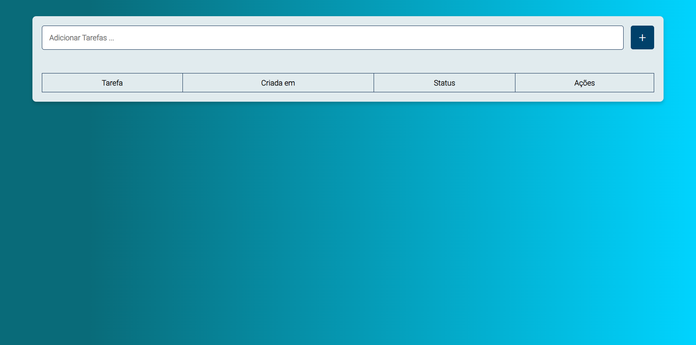

# 📋 To-Do List App

## 🌐 Visão Geral

Este é um projeto de uma aplicação To-Do List desenvolvida como um CRUD (Create, Read, Update, Delete) utilizando Node.js no backend e HTML, CSS, e JavaScript no frontend.

## 🚀 Funcionalidades Principais

- Adicionar novas tarefas.
- Editar informações de tarefas existentes.
- Excluir tarefas.
- Visualizar o status de cada tarefa.

## 💻 Tecnologias Utilizadas

### Backend

- **Node.js:** Ambiente de execução JavaScript do lado do servidor.
- **Express:** Framework web para Node.js, simplificando a criação de APIs.
- **MySQL:** Banco de dados relacional para armazenamento de dados.
- **Docker:** Utilizado para configurar o banco de dados.

### Frontend

- **HTML, CSS, JavaScript:** Tecnologias web padrão para criar a interface do usuário.

## 📂 Estrutura do Projeto

- **`backend/`:** Contém o código do servidor Node.js.
- **`frontend/`:** Contém os arquivos HTML, CSS e JavaScript da interface do usuário.

## 🚀 Como Usar

1. Clone o repositório:
    ```bash
    git clone https://github.com/alyssonrafael/to-do-list-Nodejs
    ```

2. Configure o backend:
    - Siga as instruções no README dentro da pasta `backend/`.

3. Configure o frontend:
    - Siga as instruções no README dentro da pasta `frontend/`.

4. Inicie o aplicativo:
    - Abra o arquivo `frontend/index.html` no seu navegador.

## 📸 Capturas de Tela
. Tela inicial

. Tarefas adicionadas


## 👥 Autores

- Alysson Rafael


## 📝 Licença

Este projeto é licenciado sob a Licença MIT.
